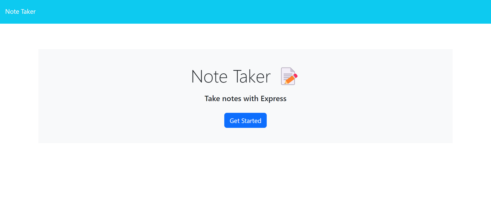
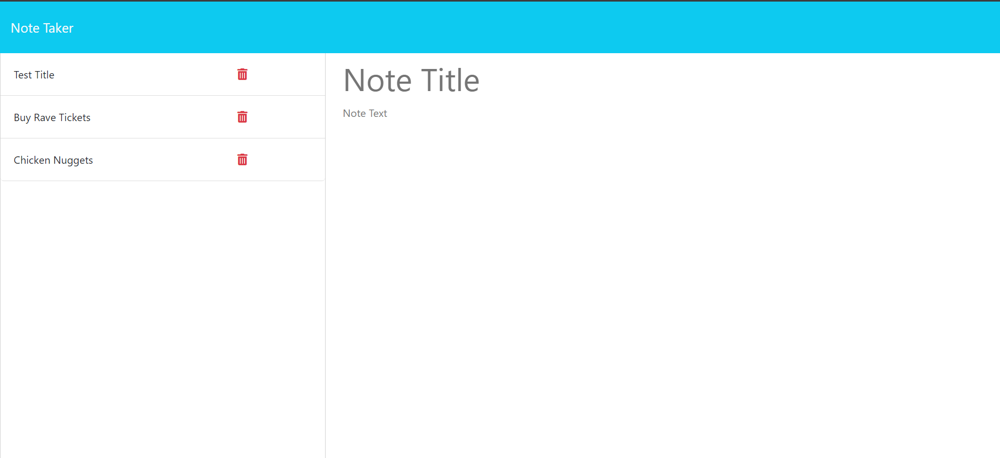

# Note Taker

## Description
A website where you can write down and keep track of all your notes. Don't need a note anymore, that's cool too, you can delete it.

## Technologies Used
Javascript, HTML, CSS, Express, Node modules.

## Installation
1. Clone the repository: git clone https://github.com/yourusername/note-taker.git
2. cd into the project
3. npm run start

## Usage
1. Open your terminal
2. Type in npm run start
3. Click on Get Started
4. Start a new note
5. Save the note
6. Delete the note

## Contributing
If you would like to contribute to this project, please fork the repository and submit a pull request with any changes.

## License
This project is not licensed.

## Links
Github: # logo-maker

## Description
An SVG Logo generator. A simple way to create a little logo. Just follow the steps in usage and you're good to go!

## Technologies Used
Javascript, Inquirer, Jest, Node modules.

## Installation
1. Clone the repository: git clone https://github.com/yourusername/logo-maker.git
2. cd into the project
3. run node index.js

## Usage
1. Open your terminal
2. Type in node index.js
3. Follow the prompts in the command line
4. Click on the newley genarated logo.svg
5. Preview in preferred browser

## Contributing
If you would like to contribute to this project, please fork the repository and submit a pull request with any changes.

## License
This project is not licensed.

## Links
Github: https://github.com/Betzaida96/note-taker
Render: https://note-taker-upjv.onrender.com/

## Photos

